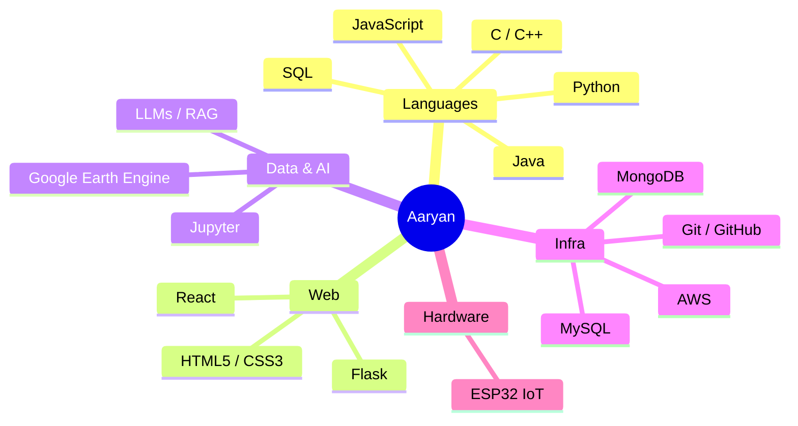

<div align="center">
  <h1>Hi there, I'm Aaryan Gupta👋</h1>
  <h3>Developer | DATA SCIENCE | AI & Machine Learning Enthusiast | Problem Solver</h3>

  
</div>

---

### 🚀 About Me
* 🔭 I’m currently building and experimenting with **AI applications, data analysis tools, and interactive web platforms**.
* 💡 Passionate about **Computer Science, Software Engineering, and Full-Stack Development**.
* 🎓 Always learning new frameworks, algorithms, and technologies to solve real-world problems.
* 📫 How to reach me: **aaryang0108@gmail.com**

<details>
<summary><b>▸ click to expand — running <code>cat about.log</code></b></summary>
<br/>

```
[00:01] booting profile...
[00:02] role      → Developer · Data Scientist · AI/ML Enthusiast
[00:03] currently → building AI apps, data pipelines, web platforms
[00:04] obsessed  → LLMs, RAG pipelines, geospatial data, IoT
[00:05] learning  → new frameworks & algorithms, weekly
[00:06] contact   → aaryang0108@gmail.com
[00:07] status    → probably debugging with print() right now
[00:08] process complete. no errors. (mostly)
```

</details>

---

### 💻 Tech Stack & Tools

#### ⚡ Programming Languages
<div align="center">
  
  
  
  
  
  
</div>
<br />

#### 🌐 Frontend, Backend & Web Frameworks
<div align="center">
  
  
  
  
</div>
<br />

#### 🗄️ Databases & Cloud
<div align="center">
  
  
  
</div>
<br />

#### 🤖 AI, Data Science & Geospatial
<div align="center">
  
  
  
</div>
<br />

#### 🛠️ Version Control & IoT Hardware
<div align="center">
  
  
  
</div>

---

### 🗺️ How My Stack Fits Together



---

### 📊 GitHub Stats & Activity
<div align="center">
  <!-- Stable mirror for GitHub Streak Stats -->
  
</div>
<br />
<div align="center">
  <!-- Reliable Dynamic Activity Line Graph -->
  
</div>
<br />

### 🐍 Contribution Activity
<div align="center">
  <!-- Ensure the URL below matches your exact working snake URL! -->
  
</div>
