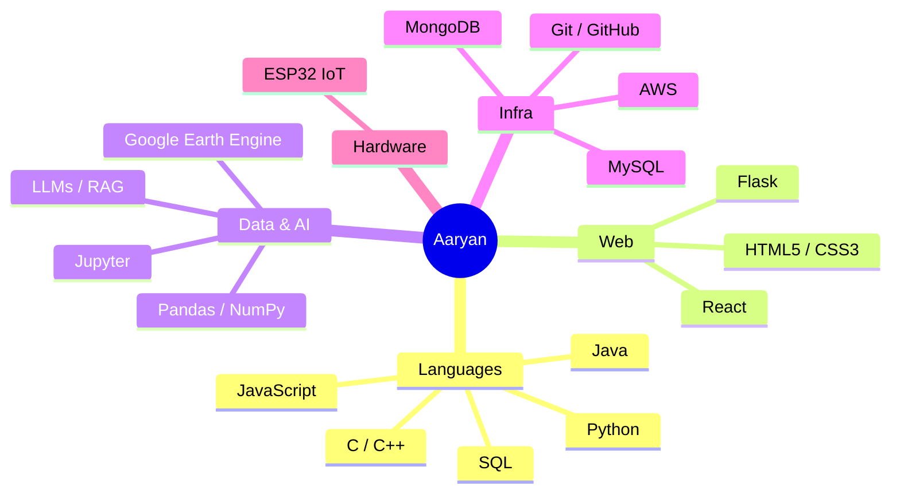

<div align="center">

<picture>
  <source media="(prefers-color-scheme: dark)" srcset="https://capsule-render.vercel.app/api?type=waving&color=0:0f2027,100:2c5364&height=230&section=header&text=AARYAN%20GUPTA&fontSize=52&fontColor=00F2FE&animation=fadeIn&fontAlignY=40&desc=Data%20Science%20·%20AI%20%2F%20ML%20·%20Full-Stack&descAlignY=58&descColor=E0E0E0" />
  <source media="(prefers-color-scheme: light)" srcset="https://capsule-render.vercel.app/api?type=waving&color=0:a8edea,100:fed6e3&height=230&section=header&text=AARYAN%20GUPTA&fontSize=52&fontColor=1a1a2e&animation=fadeIn&fontAlignY=40&desc=Data%20Science%20·%20AI%20%2F%20ML%20·%20Full-Stack&descAlignY=58&descColor=333333" />
  
</picture>


</div>

<br/>

<table>
<tr>
<td width="60%" valign="top">

### 🧠 `whoami`

<details open>
<summary><b>▸ click to expand — running <code>cat about.log</code></b></summary>
<br/>

```
[00:01] booting profile...
[00:02] role      → Developer · Data Scientist · AI/ML Enthusiast
[00:03] currently → building AI apps, data pipelines, web platforms
[00:04] obsessed  → LLMs, RAG pipelines, geospatial data, IoT
[00:05] learning  → new frameworks & algorithms, weekly
[00:06] contact   → aaryang0108@gmail.com
[00:07] status    → probably debugging with print() right now
[00:08] process complete. no errors. (mostly)
```

</details>

</td>
<td width="40%" valign="top">

### 📌 Quick Facts
- 🔭 Building **AI + data tools**
- 💡 Full-stack dev at heart
- 🌱 Always leveling up
- 📫 `aaryang0108@gmail.com`
- ⚡ Fun fact: my code works and I have no idea why

</td>
</tr>
</table>

---

### 🗺️ How My Stack Fits Together



> Rendered natively by GitHub — no image, no badge, just Mermaid. Click-and-drag on desktop.

---

### ⚙️ Toolbox

<div align="center">


<br/><br/>


</div>

---

### 📊 The Numbers

<div align="center">

<picture>
  <source media="(prefers-color-scheme: dark)" srcset="https://github-readme-stats.vercel.app/api?username=AaryanGupta01&show_icons=true&theme=tokyonight&hide_border=true&bg_color=00000000" />
  <source media="(prefers-color-scheme: light)" srcset="https://github-readme-stats.vercel.app/api?username=AaryanGupta01&show_icons=true&theme=default&hide_border=true&bg_color=00000000" />
  
</picture>

<picture>
  <source media="(prefers-color-scheme: dark)" srcset="https://streak-stats.demolab.com/?user=AaryanGupta01&theme=tokyonight&hide_border=true&background=00000000" />
  <source media="(prefers-color-scheme: light)" srcset="https://streak-stats.demolab.com/?user=AaryanGupta01&theme=default&hide_border=true&background=00000000" />
  
</picture>


</div>

---

### 🐍 Live Contribution Snake

<div align="center">

<picture>
  <source media="(prefers-color-scheme: dark)" srcset="https://raw.githubusercontent.com/AaryanGupta01/AaryanGupta01/output/github-contribution-grid-snake-dark.svg" />
  <source media="(prefers-color-scheme: light)" srcset="https://raw.githubusercontent.com/AaryanGupta01/AaryanGupta01/output/github-contribution-grid-snake.svg" />
  
</picture>

<sub>⚠️ Needs the snake-generation GitHub Action running on this repo — see note below.</sub>

</div>

---

<div align="center">

### 📬 Let's Build Something

<a href="mailto:aaryang0108@gmail.com"></a>
<a href="https://github.com/AaryanGupta01"></a>

<br/><br/>

<picture>
  <source media="(prefers-color-scheme: dark)" srcset="https://capsule-render.vercel.app/api?type=waving&color=0:2c5364,100:0f2027&height=100&section=footer" />
  <source media="(prefers-color-scheme: light)" srcset="https://capsule-render.vercel.app/api?type=waving&color=0:fed6e3,100:a8edea&height=100&section=footer" />
  
</picture>

</div>
